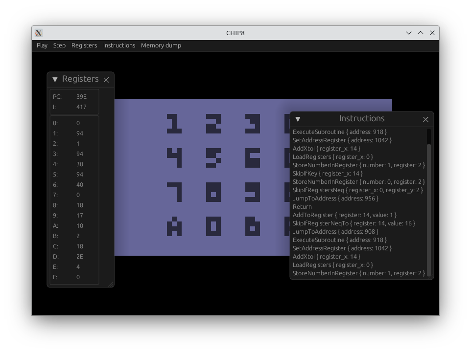

= chip8stuff
:experimental:

Simple interpreter to execute https://en.wikipedia.org/wiki/CHIP-8[CHIP-8] games.

Passes the https://github.com/Timendus/chip8-test-suite[Timendus/chip8-test-suite] tests (except for the _display wait_ quirk).
The sound timer and playback is not implemented yet, since I have not yet tested any rom that makes use of it.

Rendering is done using the https://github.com/parasyte/pixels[Pixels] crate.
Tested only on Linux and X11.

== Usage

Pass the rom file via command line argument
[source, shell]
----
./chip8stuff <ROM_FILE>
----

Use `--paused` to start the debugger in paused mode, allowing you to single-step right from the start.

[source, shell]
----
./chip8stuff <ROM_FILE> --paused
----

Use `--verbose` for detailed logging and `--help` for usage help.

== Input

The original hex keypad
[width=25%]
|==============
| kbd:[1] | kbd:[2] | kbd:[3] | kbd:[C]
| kbd:[4] | kbd:[5] | kbd:[6] | kbd:[D]
| kbd:[7] | kbd:[8] | kbd:[9] | kbd:[E]
| kbd:[a] | kbd:[0] | kbd:[B] | kbd:[F]
|==============

is mapped to the keyboard as following:
[width=25%]
|==============
| kbd:[1] | kbd:[2] | kbd:[3] | kbd:[4]
| kbd:[Q] | kbd:[W] | kbd:[E] | kbd:[R]
| kbd:[A] | kbd:[S] | kbd:[D] | kbd:[F]
| kbd:[Y] | kbd:[X] | kbd:[C] | kbd:[V]
|==============

== Debug features

- view register values
- view executed instructions
- pause execution/single step
- dump memory to a file, the exact file name will be printed on `stdout` at `info` level

